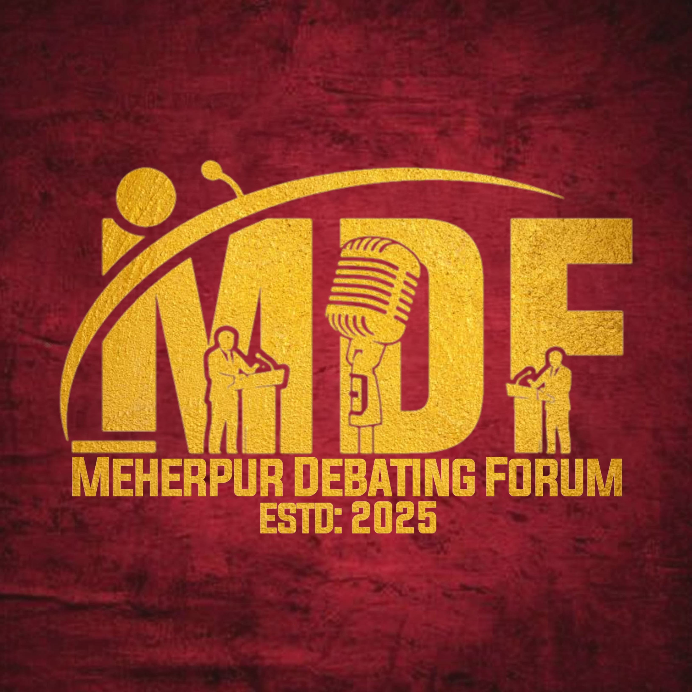

  

 

  

  <h1>Meherpur Debating Forum</h1>

  
   
  

    
  
  

 

  

---

### Ⅰ. THE INTELLECTUAL HUB

  
  

 

Meherpur Debating Forum (MDF) is a premier platform dedicated to fostering the next generation of thinkers, speakers, and leaders. We believe that structured discourse is the cornerstone of progress, providing a space where intellect meets eloquence and ideas are refined through rigorous analysis.

---

### Ⅱ. OUR MISSION

  

* 🛠️ **Analytical Excellence:** Cultivate deep logical reasoning and the ability to dissect complex issues.
* 🎤 **Articulate Communication:** Transform potential into proficiency by building confident and persuasive public speakers.
* 🤝 **Principled Discourse:** Champion the ethics of respectful, evidence-based, and meaningful debate.
* 🚀 **Visionary Leadership:** Harness the power of communication to develop decisive leadership qualities in our youth.

---

### Ⅲ. CORE ACTIVITIES

| Activity | Focus | Frequency |
| :--- | :--- | :--- |
| **Weekly Sessions** | Practice rounds and peer feedback. | `Every Week` |
| **Competitions** | Internal and inter-city tournaments. | `Seasonal` |
| **Workshops** | Training on motion analysis and BP format. | `Monthly` |
| **Masterclasses** | Specialized training in public speaking. | `Quarterly` |

---

### Ⅳ. DYNAMIC ACTIVITY

  

---

### Ⅴ. ANALYTICS

  
  

 

  

---

### Ⅵ. THE PHILOSOPHY

> *"Truth is not what you want it to be; it is what it is, and you must bend to its power or live a lie."*

---

### Ⅶ. CONNECT WITH US

  
Join the movement of articulate leadership and logical rebellion.

  
  

 

---

  <b>BUILDING VOICES. SHAPING LEADERS. DEFINING THE FUTURE.</b>

